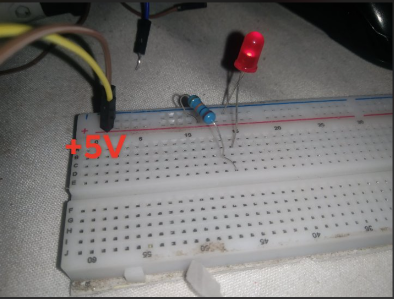
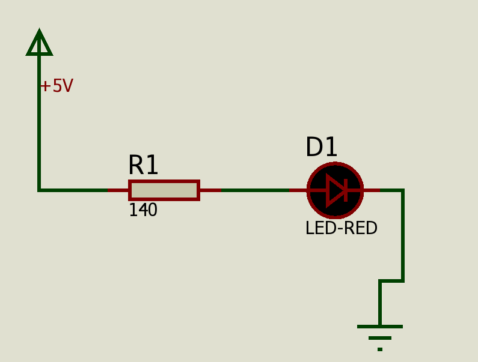

# PROJECT-01-BASIC-LED-CIRCUIT
This project demonstrates a simple LED circuit using a resistor and a battery. It applies basic electronics concepts like Ohm’s Law and current limiting.

## 📷 Preview

## ⚙️ Components
- LED (RED 2.2V @ 20mA)
- Resistor (140Ω)
- Battery (5V)
- Breadboard
- Jumper wires

## 🔌 Circuit Diagram

## 🧮 Calculations

Formula for resistor:
R = (Vsource - Vf) / If

Vsource = 5V (power supply)
Vf = 2.2V (voltage rate of the led)
If = 0.02A (Current rate of the led)

R = (5 - 2V) / 0.02A = 140Ω

## 🚀 How It Works
The resistor limits the current flowing through the LED to prevent damage.
When the circuit is connected, current flows from the battery → resistor → LED → ground, lighting up the LED.

## 📚 What I Learned
- Basic circuit design
- Importance of resistors
- Ohm’s Law application

## 🔮 Future Improvements
- Add multiple LEDs
- Use a microcontroller (Arduino)
- Add brightness control (PWM)

